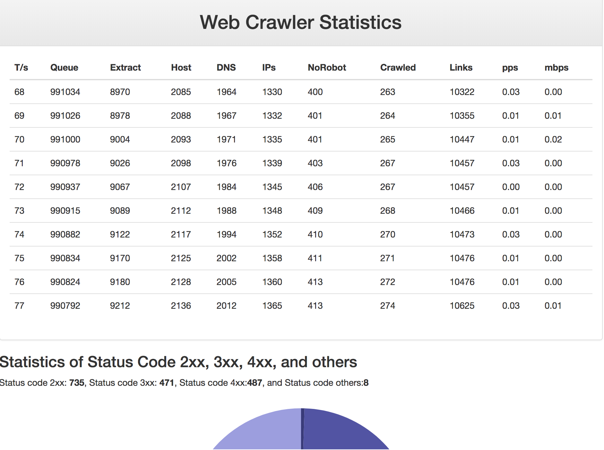

Multi-threaded Web Crawler

The program consists of two parts: front end part and back end part. In the back end part, the C++ program crawling a significant amount of URLs with many threads, and a shared queue is used to coordinate between threads, and a separate thread is also used to collect all statistics information, such as url crawled, bytes received, links parsed from pages. Also, the statis thread is also responsible to send statistic information to the front end. I have used the [uWebSockets](https://github.com/uNetworking/uWebSockets) to communicate between back end and front end, and the data is sent through Json format.

In the front end, Node.js is used to display the statistic information. I have deployed the front end in [AWS](http://ec2-54-213-242-87.us-west-2.compute.amazonaws.com:3036/), but the back end is with my laptop, so the crawled information is sent to the front end once connection is established.

For the C++ files, simply go with cmake, build and use the format

```
./crawler num_threads url_files
```

If anything goes wrong with the environment setupt, refer this [post](https://github.com/snmnmin12/CarND-Path-Planning-Project) for information.

Below is the screenshot of the statistic information.

